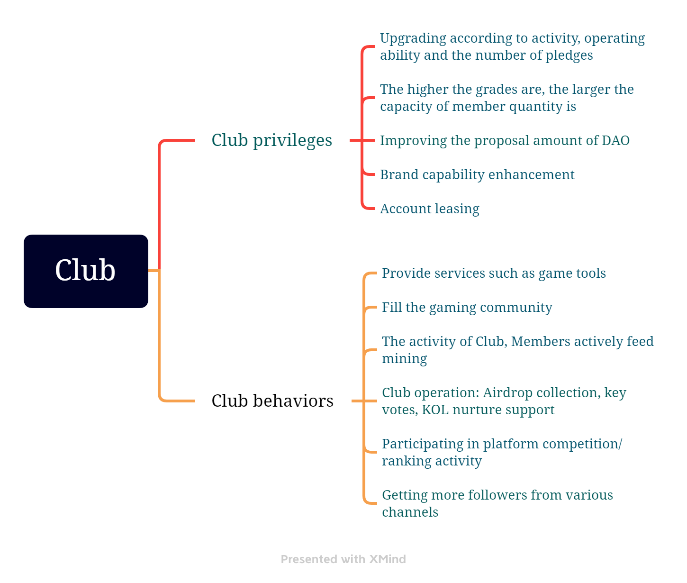

# 4.4 Club

During the development of the platform, players will spontaneously form groups or fraternity groups, and some mature groups may enter the platform. They will establish Club in the form of pledge, cultivate high-quality KOL, actively promote THE DAO agenda, become the project side, form common interests with the platform through pledge, and jointly create UGC content of the platform.

In the middle and later stages of community development, DAO-style clubs will be the driving force for community proposals, and multiple clubs will form competitive relationships.

